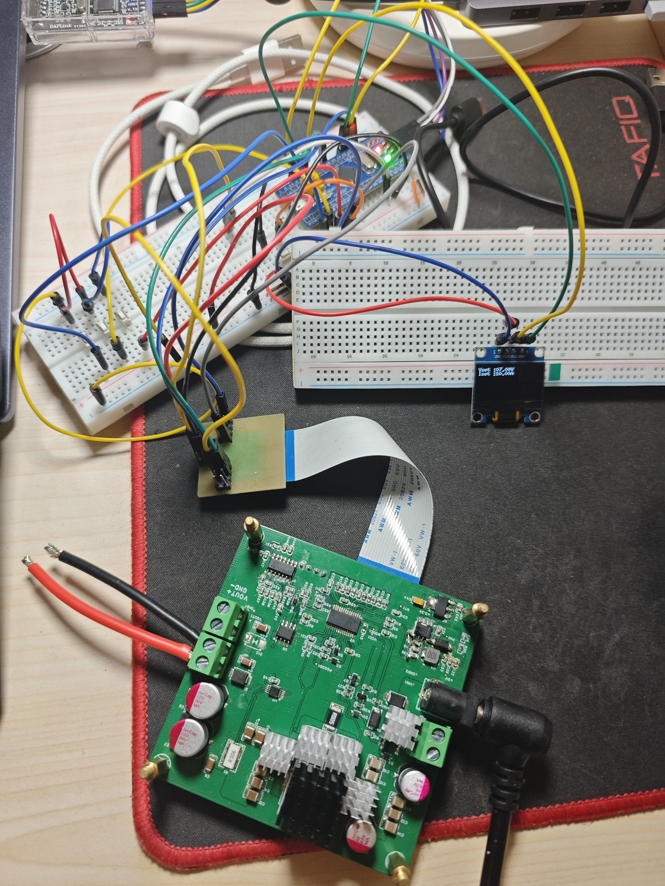
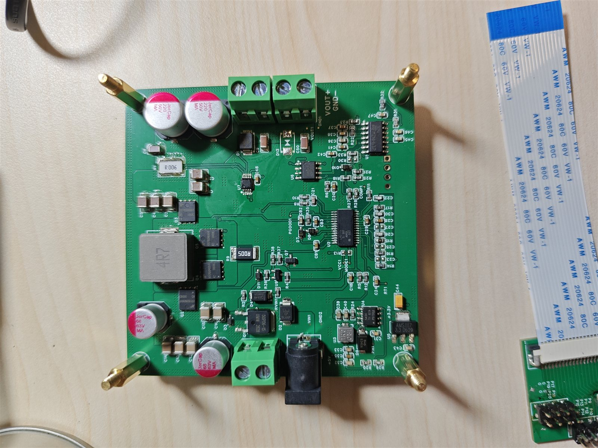
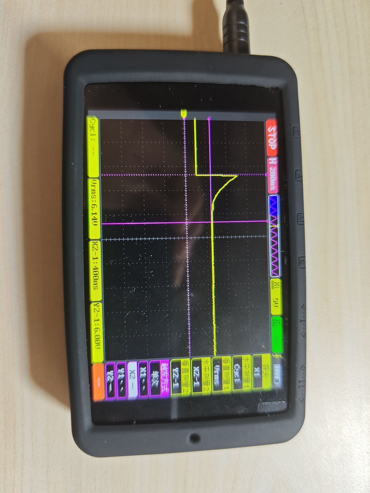
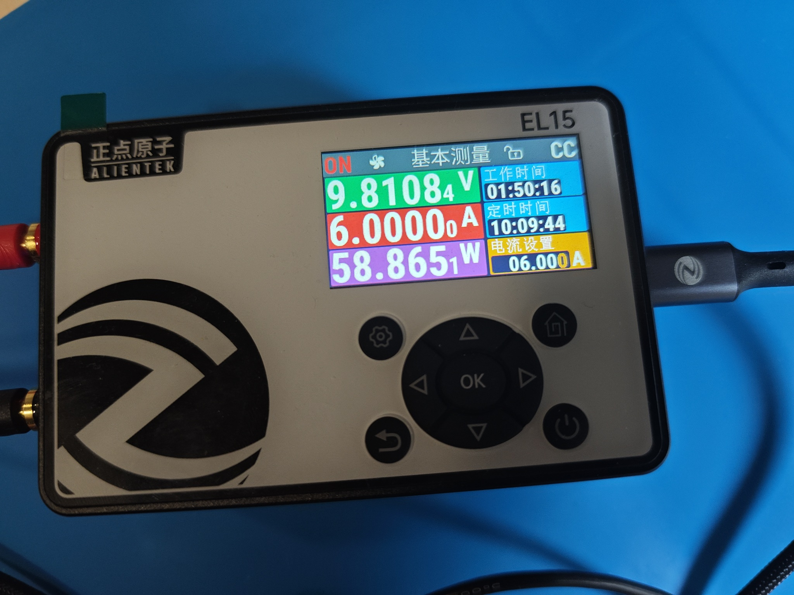
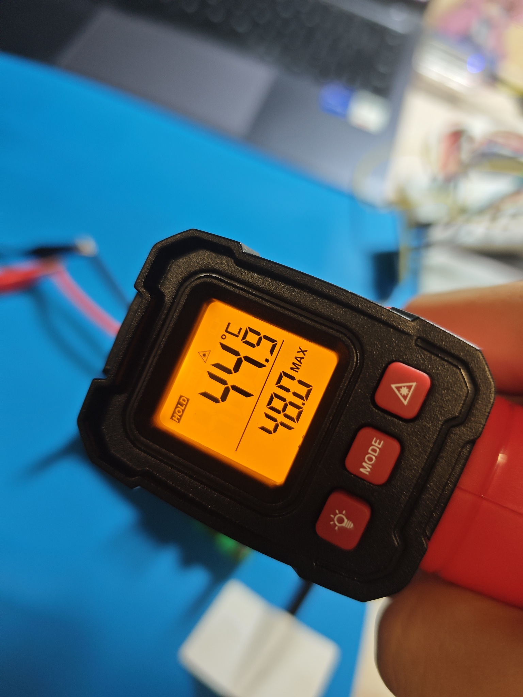
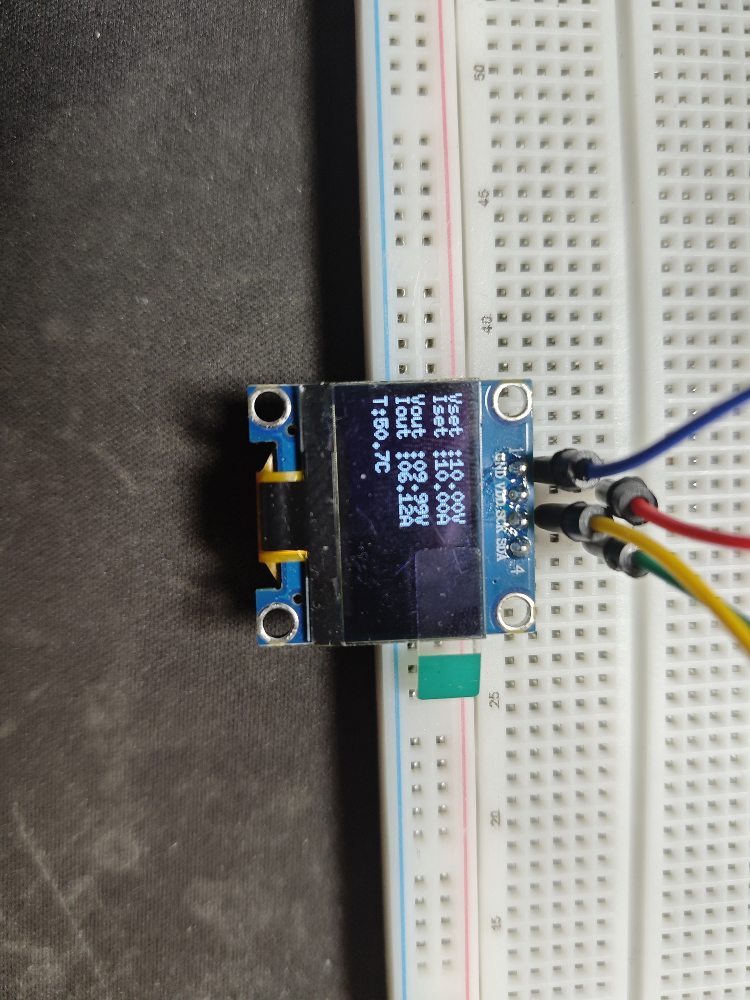

# Power Control · LM5175 数控电源固件

基于 **STM32F103C8T6** 的四开关升降压（**LM5175**）数字电源控制固件：RTOS 多任务实时采集与闭环稳压、按键调压、OLED 人机界面、故障降级与自恢复。功率级原理图依据 TI LM5175 评估板与数据手册自行设计（元件数值全部亲手计算、BOM 自行选型），布局参考嘉立创开源方案；主控由原方案的 STM32F407 降为 F103C8T6，固件全部自研。

## 实测指标

| 指标 | 结果 |
| --- | --- |
| 负载 / 设定值突变 | 500 ms 内恢复稳定 |
| 满载 6 V / 10 A | 电压跌落 0.02 V，负载调整率 0.3% |
| 输出能力 | 最高 120 W（功率级上限） |
| 长时间考核 | 60 W（10 V / 6 A），已连续运行近 2 小时，总目标 12 小时（进行中） |
| 最高温度 | 65 ℃ |
| 短路 | LM5175 限流 + 打嗝保护自动闭锁，故障解除后自恢复 |
| 固件体积 | ROM 43.1 KB / 64 KB，RAM 14.4 KB / 20 KB |
| OLED 单帧刷新 | ≈ 23 ms（1 KB 帧缓冲 @400 kHz I2C） |
| 编译 | ARM Compiler 6（armclang V6.24），0 错 0 警 |

## 实拍与实测

| 整机连线测试 | 功率板（未连线） |
| --- | --- |
|  |  |

| 15 V → 6 V 跳变响应 | 长时间考核 60 W（10 V / 6 A） |
| --- | --- |
|  |  |

| 散热片表面温度 | SH1106 显示界面 |
| --- | --- |
|  |  |

> 其余测试照片（6 V → 7 V 跳变响应、空载输出纹波）见 `picture/` 目录。

## 代码规模

| 分类 | 文件 | 代码行（去注释） |
| --- | --- | --- |
| 自研 · 应用层 `Core/app` | 7 | 148 |
| 自研 · 传感器层 `Core/sensors` | 8 | 369 |
| 自研 · CubeMX 文件内 USER CODE | — | 458（`freertos.c` 395） |
| **自研合计** | 15 | **≈ 975** |
| CubeMX 生成（`Core/Src` + `Core/Inc`，含上表 USER CODE） | 18 | 1 510 |
| 第三方 · ST HAL / CMSIS 驱动包 | 788 | 349 755（多数未参与编译） |
| 第三方 · FreeRTOS | 39 | 13 967 |
| 第三方 · u8g2 | 48 | 34 424（其中 `u8x8_fonts.c` 未使用） |

自研约 1 千行代码支撑起 6 个 RTOS 任务、3 层传感器驱动、PID 闭环、OLED 显示与故障自恢复；最终固件 ROM 43.1 KB、RAM 14.4 KB。

## 硬件

- 主控：STM32F103C8T6 @72 MHz（HSE）
- 功率级：LM5175 四开关升降压。**原理图依据 TI LM5175 评估板与数据手册自行设计，元件数值全部亲手计算，BOM 自行选型**；PCB 布局参考嘉立创开源方案；自行焊接与调试
- 与原开源方案的差异：主控由 STM32F407 降为 STM32F103C8T6（资源与成本裁剪）；原方案每个芯片独占一路 I2C 信号通道，本设计合并为 I2C1（INA226 + TMP112）+ I2C2（OLED），省引脚的同时把总线争用交给软件层处理（见总线层互斥锁与按器件错误计数）
- 采样：INA226（电压 / 电流）+ TMP112（温度），同挂 I2C1（100 kHz）
- 显示：SH1106 128×64 OLED，挂 I2C2（400 kHz）
- 交互：PA8 输出使能键、PB13/PB14/PB15 限流切换 / 降压 / 升压、PC13 状态灯、PA9 输出使能电平（均带 EXTI 唤醒）
- 控制：TIM3_CH1（PA6）输出 18 kHz PWM，比较值由 PID 调节；TIM2_CH1（PA0）另有一路 PWM；TIM1（1 µs 时基）供微秒级延时；USART2（PA2/PA3）预留上位机通讯

## 软件架构

### 任务（FreeRTOS / CMSIS-RTOS2）

| 任务 | 周期 | 优先级 | 栈 | 职责 |
| --- | --- | --- | --- | --- |
| `sensorTask` | 20 ms | Realtime1 | 256 B | INA226 / TMP112 采样与错误计数 |
| `PIDv` | 20 ms | Realtime7 | 256 B | 增量式 PID，输出 PWM |
| `buttom` | 事件驱动 | Realtime1 | 256 B | EXTI 唤醒 + 20 ms 去抖，调压 |
| `sensor_err_hand` | 1 s | Normal | 256 B | 故障恢复：总线重启、器件重初始化 |
| `screen` | 200 ms | Normal | 512 B | u8g2 刷新 OLED |
| `defaultTask` | — | Normal | 256 B | 空闲占位 |

堆 `configTOTAL_HEAP_SIZE = 8 KB`（按任务逐项核算后由 3 KB 扩至 8 KB）。HAL 时基走 TIM4，SysTick 留给内核。

### 分层

```
Core/app/          应用层：PowerState 共享状态、PID、power_config.h 参数集中
Core/sensors/      传感器层
  sensors.c          服务层：状态码归一、忙重试
  INA226AIDGSR.c     器件层：INA226 电压 / 电流
  TMP112A.c          器件层：TMP112 温度
  sensors_dev.c      总线层：I2C 句柄注入、互斥锁、超时归为忙
Core/Src/          CubeMX 生成的 HAL 初始化与任务骨架（freertos.c 内含任务体）
3rdParty/u8g2/     vendored u8g2（SH1106 全缓冲）
```

### 关键机制

- **闭环**：20 ms 定周期采样 → 增量式 PID → TIM3 比较值（限幅 300–800）；带时间戳新鲜度检查与积分复位，抗积分饱和
- **并发**：`PowerStateAcssess`、`I2CAccess` 两个互斥量；总线层取不到锁直接返回忙，控制环不被阻塞
- **容错**：连续 5 次采样失败判器件离线 → 闭锁 PWM 输出；1 s 恢复任务重启总线 / 重初始化器件，成功后自动回在线
- **参数集中**：`Core/app/inc/power_config.h`（电压上下限 1.0–15.0 V、步进 1 V、开机输出状态与设定值）

## 构建与烧录

- **主线**：VS Code + EIDE 扩展，打开 `MDK-ARM/.eide/eide.yml`（工具链 AC6）
- **备选**：Keil uVision 打开 `MDK-ARM/power_control.uvprojx`（需器件包 `Keil.STM32F1xx_DFP 2.2.0`）
- Keil 只提供器件包与编译器；`Drivers/`、`Middlewares/` 由 CubeMX 打开 `power_control.ioc` 重新生成
- 烧录：ST-Link + STM32CubeProgrammer，或把 `MDK-ARM/power_control/power_control.hex` 拖入 DAPLink 盘

## 仓库约定

只跟踪源码、工程配置与最终 hex：`Drivers/`、`Middlewares/`、器件包、编译中间产物、Keil 个人调试配置均不入库（详见 `.gitignore` 与 `MDK-ARM/.gitignore`）。

## 已知限制 / 待办

- `sensorRead()` 在总线离线分支未清结果变量，可能把上一轮的值当成功写回并刷新时间戳
- `state_res_*` 与三个器件状态局部量未初始化，首次取锁失败会读到栈上残留值
- 未启用栈溢出与 malloc 失败检测（`configCHECK_FOR_STACK_OVERFLOW` 等），任务句柄未判空
- 各任务栈水位与堆峰值尚未实测
- 死变量：`PowerState_copy_last`、`voltage_change`
- `configUSE_TIMERS` 为 1 但工程未使用软件定时器，关掉可回收约 850 B 堆
- `3rdParty/u8g2/u8x8_fonts.c` 仍有 1.5 MB 未被使用，可继续精简
- 仓库尚未添加 `.gitattributes`，工作区存在纯行尾差异噪音

## 开发日志

过程记录与决策留档见 [`MEMO.md`](MEMO.md)、[`MEMO2.md`](MEMO2.md)。
