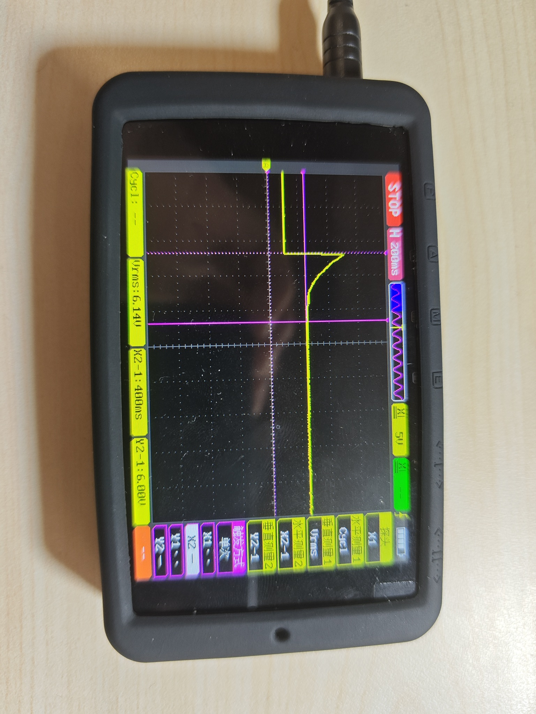
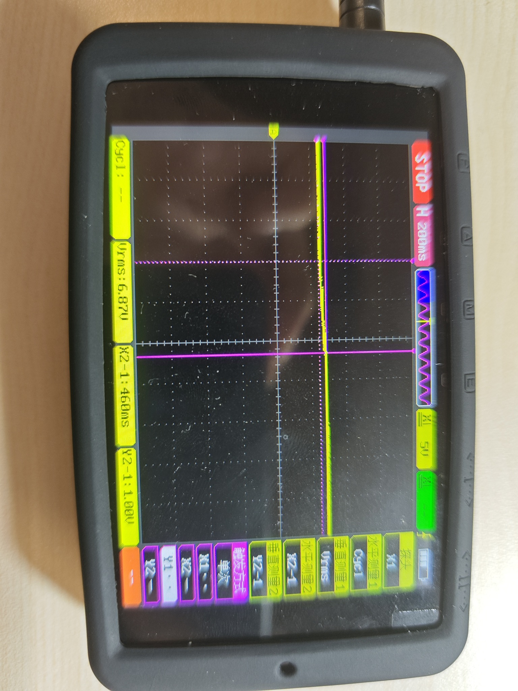
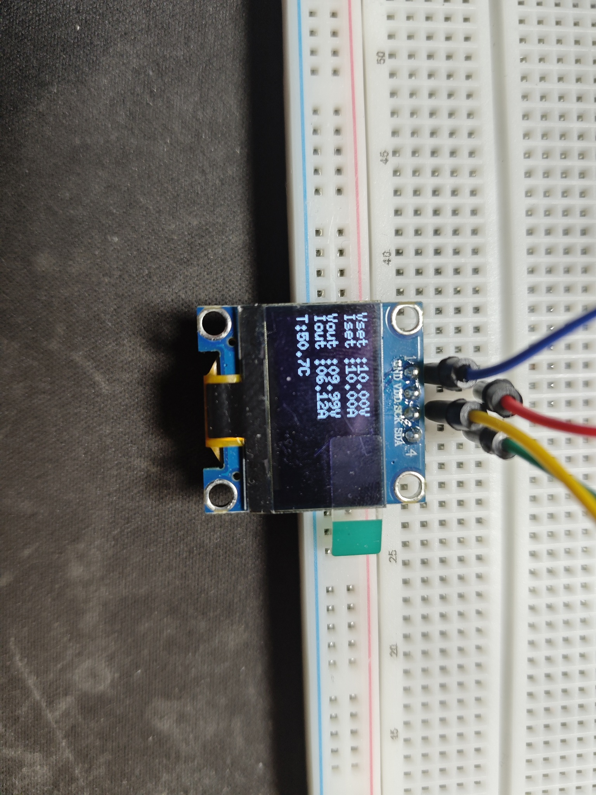

# Power Control · LM5175 数控电源固件

基于 **STM32F103C8T6** 的四开关升降压（**LM5175**）数字电源控制固件：FreeRTOS 多任务实时采集与闭环稳压、按键调压与模式切换、OLED 人机界面、故障降级与自恢复。固件全部自研。

> 硬件另册：功率级（底板）的规格、拓扑取舍、参数计算、采样与 CV/CC 环路、保护、布局热设计、实测与已知问题见 **[`HARDWARE.md`](HARDWARE.md)**；控制板（MCU + 转接座）的引脚与设计要点见该册第 11 节，原理图见第 12 节。本页只写固件侧。
> 文档口径：本页数字都能追到证据 —— 体积取自构建 map，周期、优先级、栈、引脚取自 `Core/` 源码与 `power_control.ioc`，实机指标取自实拍照片与 `MEMO*.md` 留档；查不到证据的一律不写。

## 实测指标

| 指标 | 结果 |
| --- | --- |
| 固件体积 | ROM 45.47 KB（Code 43 996 + RO 2 544 + RW 20 = 46 560 B）/ 64 KB；RAM 14.27 KB（RW 20 + ZI 14 588 = 14 608 B）/ 20 KB |
| OLED 单帧刷新 | ≈ 23 ms（128×64 全缓冲 1 KB @400 kHz I2C，由 ≈90 ms 优化而来） |
| 按键响应 | 扫描 10 ms 一轮、连读 3 次确认，单击判定延迟 100 ms，长按 1 s |
| 编译 | Arm Compiler for Embedded 6.24（armclang），最近一次 EIDE 构建 0 错 0 警 |

> 体积与编译取自 2026-10-01 19:43 的 EIDE 增量构建：`MDK-ARM/build/power_control/power_control.map` 的 Total RO/RW/ROM Size 与 `compiler.log` 的 Program Size（map 首行标 Arm Compiler for Embedded 6.24）。
> 整机与功率级实测（12 h 连续 60 W、满载 6 V / 10 A 跌落 0.02 V、动态 500 ms 恢复、开关管温升数字版 51 ℃ 与模拟板 65 ℃ 对照、输出上限 120 W、短路打嗝自恢复）见 [`HARDWARE.md`](HARDWARE.md) 第 8 节。
> OLED 刷新耗时来源：`MEMO2.md` 第 29 次条目（由 ≈90 ms 优化而来）。

## 实拍与实测

| 15 V → 6 V 跳变响应 | 6 V → 7 V 跳变响应 | SH1106 显示界面 |
| --- | --- | --- |
|  |  |  |

> 跳变响应与屏幕界面是固件闭环与显示的直接证据；整机、功率板、长时间考核与散热片照片见 [`HARDWARE.md`](HARDWARE.md) 第 12 节。

## 代码规模

| 分类 | 文件 | 代码行（去空行与注释） |
| --- | --- | --- |
| 自研 · 应用层 `Core/app` | 11 | 366 |
| 自研 · 算法层 `Core/algorithm` | 2 | 59 |
| 自研 · 传感器层 `Core/sensors` | 8 | 369 |
| 自研 · CubeMX 文件内 USER CODE | — | 582（`freertos.c` 545） |
| **自研合计** | 21 | **1 376** |
| CubeMX 生成（`Core/Src` + `Core/Inc`，含上表 USER CODE） | 20 | 1 689 |
| 第三方 · ST HAL / CMSIS 驱动包 | 788 | 349 755（多数未参与编译） |
| 第三方 · FreeRTOS | 39 | 13 967 |
| 第三方 · u8g2 | 48 | 34 424（其中 `u8x8_fonts.c` 1.6 MB 未使用） |

> 统计口径：去空行、去注释行（`//` 与 `/* */`，含尾随注释的行仍计为代码行）；第三方按目录全量统计，不按实际链接筛选。

自研约 1.4 千行代码支撑起 8 个 RTOS 任务、3 层传感器驱动、PI 闭环、按键状态机、OLED 显示与故障自恢复；最终固件 ROM 45.47 KB、RAM 14.27 KB。

## 软件架构

### 任务（FreeRTOS / CMSIS-RTOS2）

| 任务 | 周期 | 优先级 | 栈 | 职责 |
| --- | --- | --- | --- | --- |
| `sensorTask` | 20 ms | Realtime1 | 640 B | INA226 / TMP112 采样与按器件错误计数 |
| `PIDv` | 50 ms | Realtime7 | 640 B | PI（CV / CC）→ TIM3 比较值 |
| `buttomDetectTas` | 10 ms | Realtime1 | 512 B | 四键去抖状态机，出按键事件入队 |
| `buttom` | 事件驱动 | Realtime1 | 512 B | 取队列事件，按 `key_f` 分支执行 |
| `sensor_err_hand` | 200 ms | Normal1 | 768 B | 故障恢复：总线重启、器件与屏幕重初始化 |
| `screen` | 400 ms | Normal1 | 768 B | `screen.c` 组织内容并刷新 OLED |
| `iwdog_feed` | 300 ms | Realtime7 | 256 B | 刷新 IWDG |
| `defaultTask` | — | Normal | 512 B | 空闲占位 |

队列 `myQueue01`：深度 8、元素 8 B（`key_f` + 事件类型）。堆 `configTOTAL_HEAP_SIZE = 8 KB`（内核 V10.3.1，heap_4）。HAL 时基走 TIM4，SysTick 留给内核。以上取自 `freertos.c` 的任务定义与 `power_control.ioc` 的 `Tasks01` / `Queues01`，两者一致。

### 分层

```
Core/app/          应用层：PowerState 共享状态与锁钩子、power_config.h 参数集中
  screen.c/.h        OLED 显示：screen_printf 统一格式化，设定值与实测值两段
  buttom_detect.c/.h 按键状态机：单击 / 长按（双击预留未实现）
  uart_dev.c/.h      UART 设备层；uart_debug.c/.h 打印层
Core/algorithm/    算法层：PI（f_PI_calcu_keep 输出脉冲增量），常量集中在 pid.h
Core/sensors/      传感器层
  sensors.c          服务层：状态码归一、忙重试
  INA226AIDGSR.c     器件层：INA226 电压 / 电流
  TMP112A.c          器件层：TMP112 温度
  sensors_dev.c      总线层：I2C 句柄注入、互斥锁、超时归为忙、9 拍释放总线
Core/Src/          CubeMX 生成的 HAL 初始化与任务骨架（freertos.c 内含 8 个任务体）
3rdParty/u8g2/     vendored u8g2（SH1106 全缓冲 + 硬件 I2C 回填）
```

### 关键机制

- **按键三层**：EXTI（PA8 / PB13 / PB14 / PB15，双沿 + 上拉）只置检测任务的线程标志 → 检测任务 10 ms 一轮、连读 3 次按电平多数判定按下或抬起 → 状态机出单击 / 长按事件 → 事件带 `key_f` 入 `myQueue01` → `buttom` 任务取出后按 `key_f` 分支执行（见 `freertos.c` 的 `HAL_GPIO_EXTI_Callback` / `buttom_detect` / `buttomTask`）。长按阈值 1 s，单击在 100 ms 无后续动作后判定；双击当前直接回起始态（未实现）
- **闭环**：20 ms 采样写入 `PowerState`，50 ms 取快照 → PI（常量集中在 `pid.h`：Kp = −10.0、Ki = −0.024、积分限幅 500、积分死区 0.03）→ 脉冲增量累加 → 限幅 314–768（由标定值 324/758 各放宽 10）→ TIM3 比较值。输出关闭、INA226 离线或取锁失败时清零积分且本轮不驱动
- **控制模式**：CV / CC 两态由 PB13 键切换，屏幕按模式显示设定值与限值；⚠️ 见「已知限制」第 1 条 —— 电流模式下软件仍在写电压 DAC
- **过温**：采样温度超过 90 ℃（`TEMPERATUE_LIMIT`）时置 `en_statu = PWR_EN_OFF` 并停走 PI；⚠️ 见「已知限制」第 2 条 —— 该动作不拉低使能脚
- **并发**：`PowerStateAcssess`、`I2CAccess`、`dev_uart1` 三个互斥量；取不到锁直接放弃本轮（设备层把超时归为忙），控制环不被阻塞。I2C2 未纳入互斥，屏任务与恢复任务都直接碰 `hi2c2`
- **容错**：单器件连续 5 次采样失败判离线 → 该总线重置；200 ms 恢复任务重启总线（9 个时钟脉冲 + STOP）、重初始化器件、必要时重初始化屏幕，成功后自动回在线。离线期间 PI 不更新比较值（保持上一次的值，不是把输出拉零）
- **周期测量**：`power_config.h` 的 `CYCLE_DETECT_I2C1 / SCREEN / PID` 开关，用 DWT 的 `CYCCNT` 统计任务耗时并经 UART 打印最小值 / 均值 / 最大值（DWT 在 `main.c` 启动）。当前默认 `SCREEN = ON`、其余 OFF
- **参数集中**：`Core/app/inc/power_config.h`（电压上下限 1.0–15.0 V、步进 1 V、开机输出关闭 / 6.0 V / 10 A、过温阈值 90 ℃、喂狗 300 ms、锁超时 5 / 10 ms、脉冲限幅区间、周期测量开关）

## 构建与烧录

- **主线**：VS Code + EIDE 扩展，打开 `MDK-ARM/.eide/eide.yml`（工具链 AC6，优化 level-2、每个函数独立段，输出到 `MDK-ARM/build/`；上传配置里已有 ST-Link(SWD, 4000 kHz) 与 OpenOCD 两段）
- **备选**：Keil uVision 打开 `MDK-ARM/power_control.uvprojx`（`<uAC6>1`，优化 level 2，输出目录 `MDK-ARM/power_control/`，需器件包 `Keil.STM32F1xx_DFP 2.2.0`）。⚠️ 该工程当前**没有登记** `Core/app/screen.c` 与 `Core/app/buttom_detect.c`，直接构建会缺这两个模块，先补进 APP 组再编
- Keil 只提供器件包与编译器；`Drivers/`、`Middlewares/` 由 CubeMX 打开 `power_control.ioc` 重新生成。**注意**：用 AC6 编译 FreeRTOS 的 RVDS/ARM_CM3 端口需要把 `portFORCE_INLINE` 改成 `inline __attribute__((always_inline))`，否则 armclang 直接报 10 个 `unknown type name '__forceinline'`；本机已改，但该文件在 `/Middlewares/` 忽略目录内，重新生成后要再补一次（见 `MEMO4.md` 第 39 次条目）
- **`.ioc` 已与风扇 PWM 脱钩**：`power_control.ioc` 里没有 PA11 / TIM1_CH4（`Mcu.PinsNb=22`），`tim.c` 也没有该通道的配置 —— 上一次重生成把第 39 次刚接上的 FAN_PWM 抹掉了，只剩 `main.c:115` 一行空转的启动调用。要恢复就先在 `.ioc` 里加回 PA11 = S_TIM1_CH4 再重生成
- 烧录：ST-Link + STM32CubeProgrammer。入库的 `MDK-ARM/power_control/power_control.hex` 最后写入 2026-09-28 16:23、由提交 `81d896c` 带入，**落后其后 7 个提交**（按键队列、屏幕模块、过温保护、PI 调参等都没进去），烧录前请重新构建；EIDE 的新固件在 `MDK-ARM/build/power_control/`（不入库）

## 仓库约定

只跟踪源码、工程配置、日志、原理图与最终 hex，共 128 个文件（`git ls-files`）：`Core/` 41、`3rdParty/u8g2` 48、`picture/` 16、`MDK-ARM/` 13、四册日志与两份 README、`power_control.ioc`、`.mxproject`、`.gitignore`、`.gitattributes`。

- 根 `.gitignore`：`/Drivers/`（65 MB）与 `/Middlewares/`（1.3 MB）整目录屏蔽，克隆后由 CubeMX 按 `.ioc` 重新生成
- `MDK-ARM/.gitignore`：`.cmsis/`、`.pack/`（约 87 MB）、`.eide/*`（只放行 `eide.yml`、`files.options.yml`、`env.ini`）、`/RTE/`、`build/*`（只留 `.gitkeep`）、`power_control/*`（只放行 `.gitkeep` 与 `*.hex`）、`*.uvoptx`、`*.uvguix.*`、`*.lst`
- `.gitattributes`：`* text=auto` 统一行尾（索引内 LF、检出时按平台），图片与压缩包显式标为二进制不做转换 —— 这条用来消除「索引 LF / 工作区 CRLF」造成的纯行尾差异噪音
- 硬件资料另存：功率级网表、BOM 与 PCB 图放在**仓库外**的 `pcb/` 目录，`HARDWARE.md` 只引用文件名
- 与规则的出入：`MDK-ARM/DebugConfig/*.dbgconf` 与 `MDK-ARM/EventRecorderStub.scvd` 实际已入库，`MDK-ARM/RTE/_power_control/RTE_Components.h`、`MDK-ARM/.clang-format` 也在库内

## 已知限制 / 待办

1. **电流模式写错执行器**：`PIDv` 在 `PM_CONTROL_MODE_CURRENT` 下，用电流误差算出的增量仍写到 TIM3（电压 DAC），而硬件 CC 阈值对应的 MCU_DAC_I 在 PA0 / TIM2，固件从不改它（固定 937/1000）。要么改成写 TIM2 比较值，要么明确该模式只是「软件限流」，不要再叫 CC
2. **过温保护不生效**：越过 90 ℃ 只置 `en_statu = PWR_EN_OFF`，既不拉低 PA9（MCU_EN），也不把比较值拉零，功率级仍在原输出上工作；应同时关使能或降占空比
3. **未初始化变量被读**：`Vlotage_pid` 里 `new_voltage`（`freertos.c:345` 声明、`:369` 被读）从未赋值；取锁失败那条路径上 `powerstate_copy` 也未赋值就被读（`:366-368`）；`pwm_pulse` 在 `control_mode` 取异常值时同样未初始化就参与累加
4. **FAN_PWM 通路被抹掉了**：CubeMX 重新生成后，`.ioc` 里没有 PA11 / TIM1_CH4，`tim.c` 里也没有该通道的配置与 PA11 的 AF 设置，但 `main.c:115` 仍在 `HAL_TIM_PWM_Start(&htim1, TIM_CHANNEL_4)` —— 这行现在是空转（TIM1 只做了 base init、时钟照常使能）。要恢复风扇控制，先在 `.ioc` 里加回 PA11 = S_TIM1_CH4 再重生成，然后把占空比接进控制。同源问题：`tim.h:33` 的微秒延时基准仍指向 `htim1`，`Tims_delay_us()`（`tim.c:292-299`）会清零并关掉 TIM1 计数，且 TIM1 预分频已是 719（该函数会慢 10 倍）；当前无调用点，但两处都指向同一只定时器
5. **I2C2 无锁**：`I2C_dev_lock()` 的 I2C2 分支直接返回 −1，u8g2 直接操作 `hi2c2`，屏任务与恢复任务可能同抢总线
6. **喂狗无心跳校验**：`iwdog_feed` 无条件刷新，低优先级任务卡死查不出来；调试期也未冻结 IWDG（应写 `DBGMCU_CR` 的 bit8）
7. 未启用栈溢出与 malloc 失败检测（`configCHECK_FOR_STACK_OVERFLOW` 等），任务句柄未判空；栈水位打印代码存在但 `DEV_UART_DEBUG` 未定义，实测水位与堆峰值尚未取得（8 个任务栈合计 4 608 B，堆 8 KB，余量未实测）
8. 各传感器的 `last_update_time_*` 只写不读，目前**没有**采样新鲜度检查
9. `configUSE_TIMERS` 为 1 但工程未使用软件定时器，关掉可回收约 850 B 堆
10. 死代码 / 死宏：只写不读的 `PowerState_copy_last`、无人调用的 `I2C_dev_lock/unlock()` 与 `sensors_outerdev_init()`、`pid.c` 的空壳 `i16_pid_calcu_addition()`、`freertos.c:142` 里已无定义的 `extern pid_calculate`、`buttom_detect.h` 的 `BUTTOM_KEY_*_PRESS_F` 与 `BUTTOM_F_OFFSET_*`
11. 头文件循环包含：`powerMaster.h` 与 `power_config.h` 互相 include（靠宏保护能编过，但接口边界不清晰）
12. `CYCLE_DETECT_SCREEN` 默认 ON，屏幕任务每 400 ms 打印一次耗时，发布前应关掉
13. `3rdParty/u8g2/u8x8_fonts.c` 仍有 1.6 MB 未被使用，可继续精简
14. `MDK-ARM/.eide/eide.yml` 的 `excludeList` 前缀仍是 `<virtual_root>/Drivers/u8g2/…`，规则早已失效（u8g2 现在全部参与编译，只靠链接器回收）；`powerMaster.c` 在两处重复登记
15. 两套构建的宏不一致：EIDE 多定义一个 `STM32F10X_MD`；Keil 工程另缺新模块登记（见「构建与烧录」）
16. 双击与长按的组合行为未实现，状态机里的 `buttom_sm_key_down_2 / up_2` 目前不可达

## 开发日志

过程记录与决策留档见 [`MEMO.md`](MEMO.md)、[`MEMO2.md`](MEMO2.md)、[`MEMO3.md`](MEMO3.md)、[`MEMO4.md`](MEMO4.md)；硬件设计与决策见 [`HARDWARE.md`](HARDWARE.md)。
