# Power Control · LM5175 数控电源固件

基于 **STM32F103C8T6** 的四开关升降压（**LM5175**）数字电源控制固件：RTOS 多任务实时采集与闭环稳压、按键调压、OLED 人机界面、故障降级与自恢复。功率级参考 TI LM5175 数据手册与评估板，以及立创开源广场的同类项目（见「功率级参考」），但**原理图、元件选型、参数计算与 PCB 布局全部自行完成**；主控由参考方案的 STM32F407 降为 F103C8T6，固件全部自研。

> 文档口径：本页数字都能追到证据 —— 体积取自构建 map，引脚、周期、栈取自 `Core/` 源码与 `power_control.ioc`，实机指标取自实拍照片与 `MEMO*.md` 留档；查不到证据的一律不写。

## 实测指标

| 指标 | 结果 |
| --- | --- |
| 负载 / 设定值突变 | 500 ms 内恢复稳定 |
| 满载 6 V / 10 A | 电压跌落 0.02 V，负载调整率 0.3% |
| 输出能力 | 最高 120 W（功率级上限） |
| 长时间考核 | 60 W（10 V / 6 A）连续运行满 12 小时无中断，负载实测 9.86 V / 6.000 A / 59.15 W |
| 开关管温升（数字版） | 10 A 级工况 51 ℃（未加主动散热） |
| 对照 · 模拟验证板 | 8.8 V / 10 A / 10 min 约 65 ℃（加主动散热） |
| 短路 | LM5175 限流 + 打嗝保护自动闭锁，故障解除后自恢复 |
| 固件体积 | ROM 43.5 KB（Code 42 070 + RO 2 458 + RW 20 = 44 548 B）/ 64 KB；RAM 14.25 KB（RW 20 + ZI 14 572 = 14 592 B）/ 20 KB |
| OLED 单帧刷新 | ≈ 23 ms（128×64 全缓冲 1 KB @400 kHz I2C，由 ≈90 ms 优化而来） |
| 编译 | Arm Compiler for Embedded 6.24（armclang），最近一次构建 0 错 0 警 |

> 体积与编译取自 2026-09-26 19:28 的 EIDE 构建：`MDK-ARM/build/power_control/power_control.map` 的 Total RO/RW/ROM Size 与 `compiler.log` 的 Program Size。Keil 侧同一源码另有更小的一条记录（2026-09-23 17:14，41.4 / 14.1 KB），入库的 hex 由它产出，已落后于当前源码。
> 实机指标来源：`MEMO2.md` 第 28 次条目的实机测量、第 29 次的刷屏耗时记录，12 小时考核收尾见 `MEMO3.md` 第 38 次条目；开关管换型与温升对照见「硬件决策」，对应照片见「实拍与实测」。
> 温升条件：模拟验证板跑 8.8 V / 10 A / 10 min 与 9 V / 10 A / 10 min，两轮均加主动散热；数字版为 10 A 级工况且**未加主动散热**。

## 实拍与实测

| 整机连线测试 | 功率板（未连线） |
| --- | --- |
| 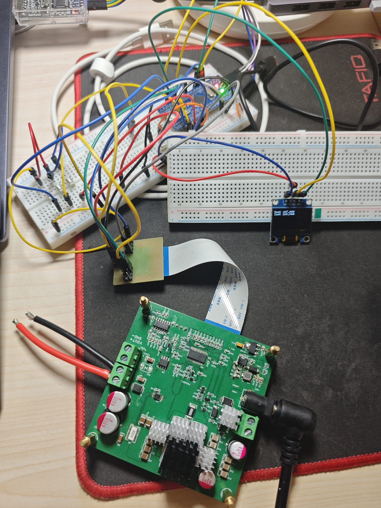 | 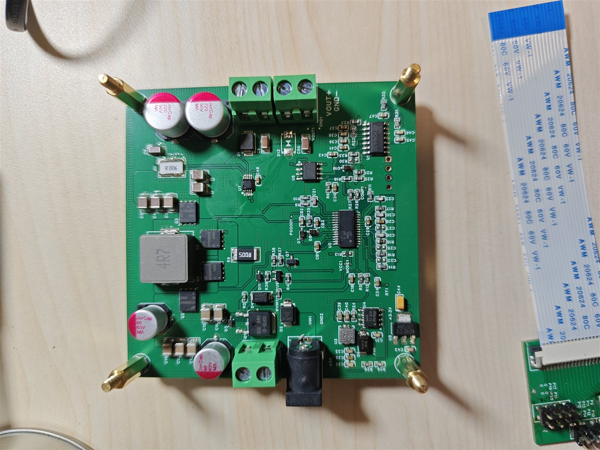 |

| 15 V → 6 V 跳变响应 | 长时间考核 60 W（10 V / 6 A） |
| --- | --- |
|  | 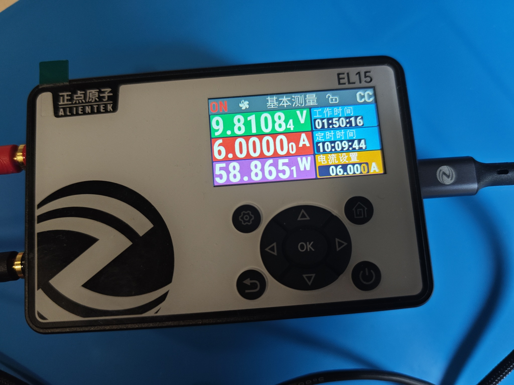 |

| 长时间考核 · 尾声（第 11 h 39 min 时拍摄） | 长时间考核测试平台 |
| --- | --- |
| 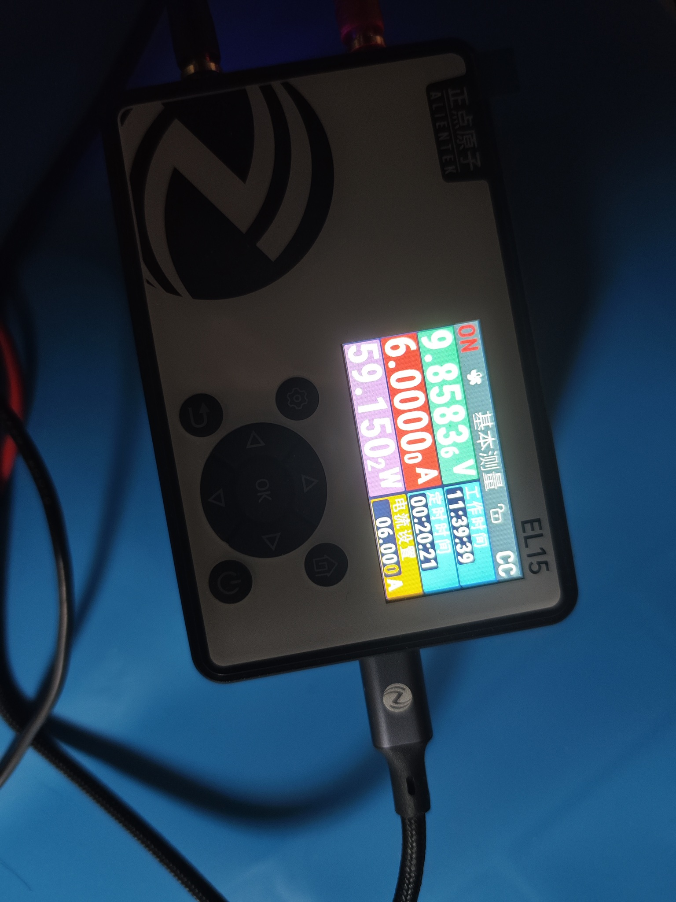 | 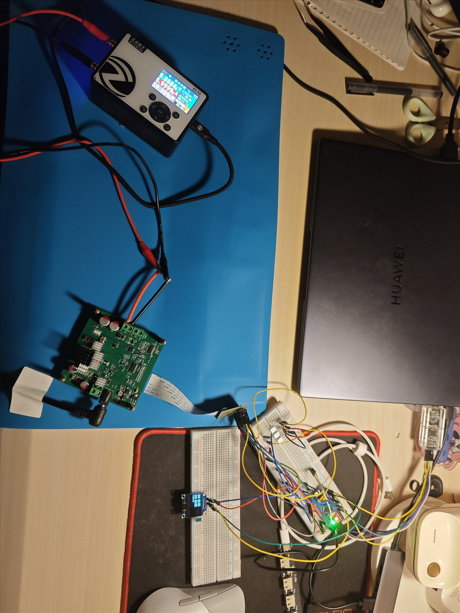 |

| 散热片表面温度 | SH1106 显示界面 |
| --- | --- |
| 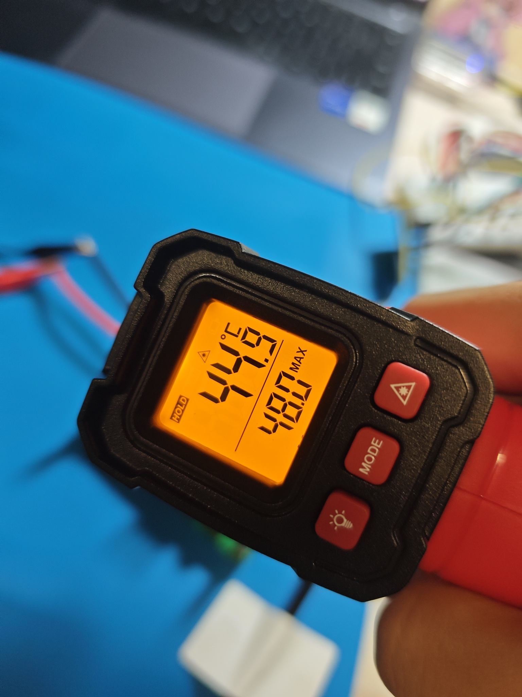 |  |

> 其余测试照片（6 V → 7 V 跳变响应、空载输出纹波）见 `picture/` 目录。

## 控制板原理图

自研控制板（STM32F103C8T6 + FPC 20P 转接），经 FPC 与功率级通信：3.3 V 供电、I2C1 读 INA226/TMP112、两路 PWM 作 DAC（PA6 电压、PA0 电流）、PA9 输出使能、PA11 风扇 PWM、PB12 回读 PGOOD。

| 主控 MCU | 复位与启动 |
| --- | --- |
| 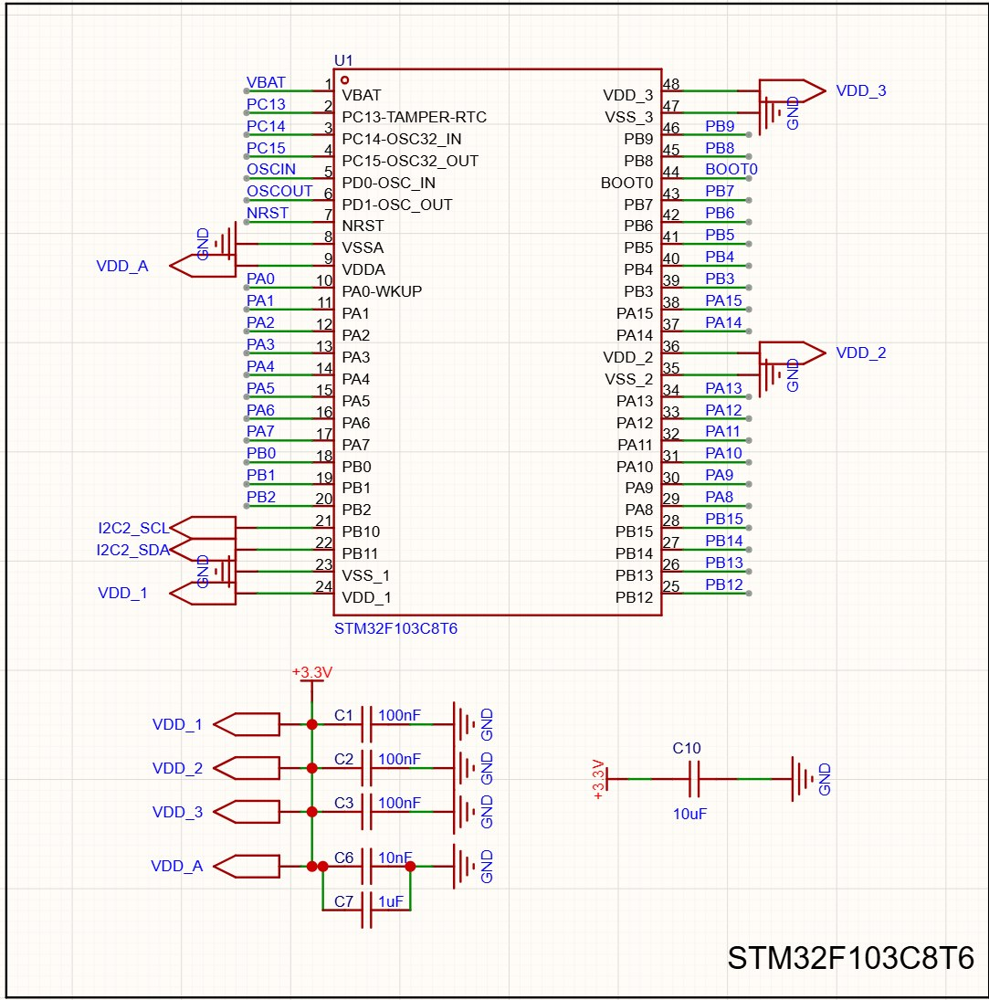 | 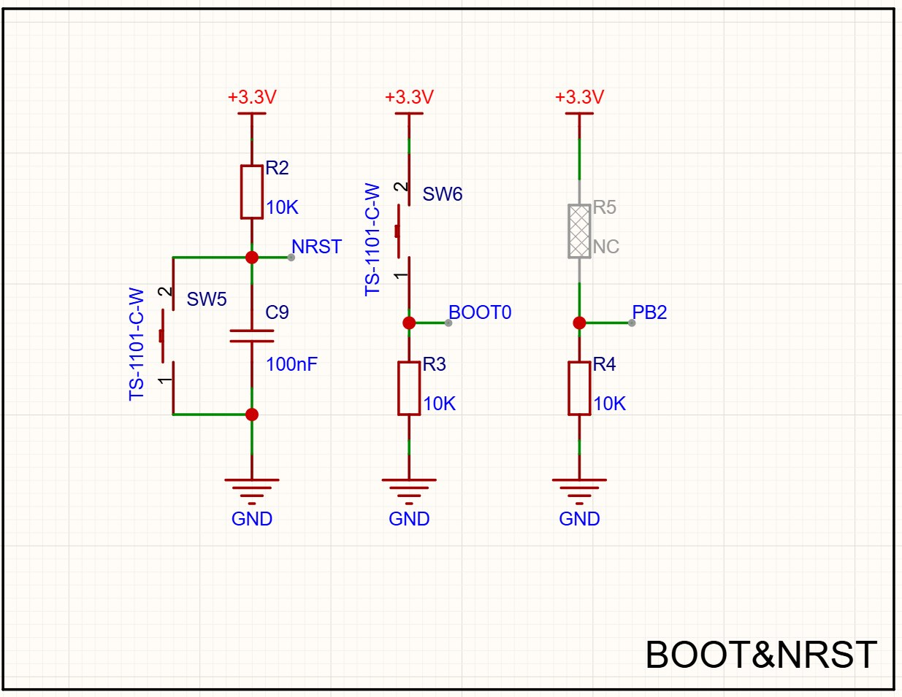 |

| 晶振、VBAT 与指示灯 | 按键与烧录口（含 USART2） |
| --- | --- |
| 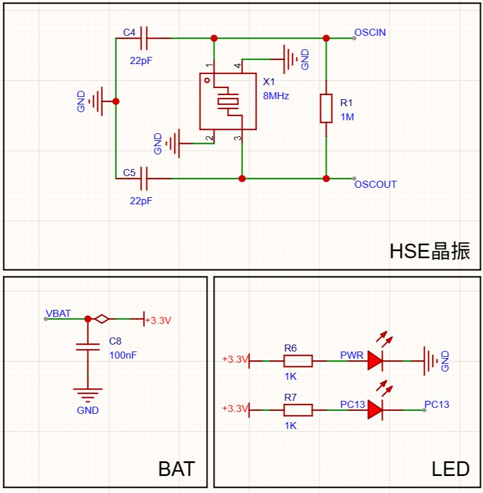 | 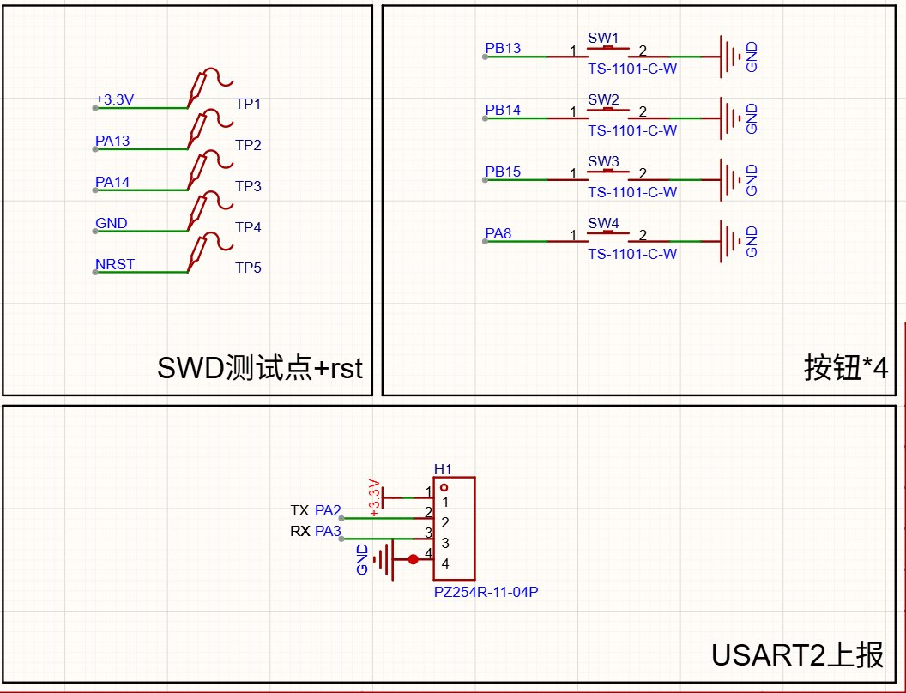 |

| FPC 排线（20P，信号与 GND 隔位） | 接口与功能映射 |
| --- | --- |
| 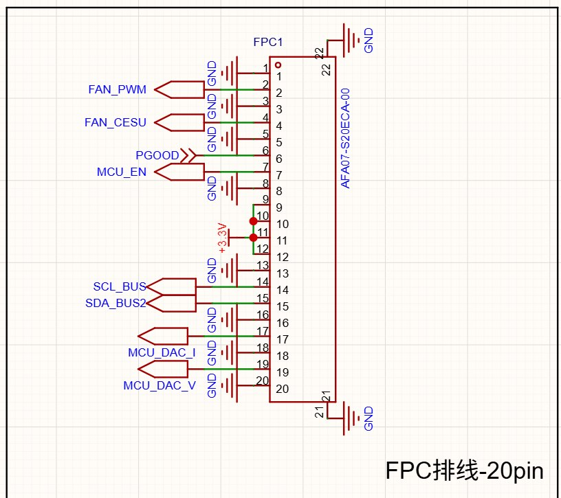 | 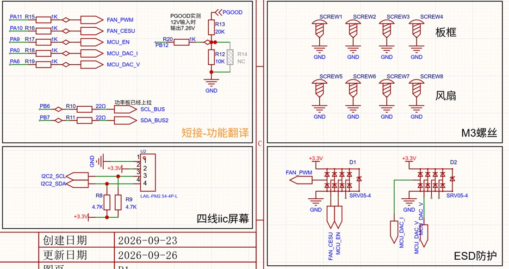 |

> 设计要点：4 个 VDD 脚各配独立 100 nF、VDDA 另配 10 nF + 1 µF、VBAT 单独 100 nF 并与 3.3 V 同轨；FPC 20 脚里 3.3 V 占 2 脚（10、11），信号 8 路（FAN_PWM 2、FAN_CESU 4、PGOOD 6、MCU_EN 9、SCL_BUS 14、SDA_BUS2 15、MCU_DAC_I 18、MCU_DAC_V 19），其余 10 脚为 GND，每根信号线左右都是 GND；I2C 走线串 22 Ω（R10/R11），I2C2 板载 4.7 K 上拉（R8/R9，四线屏座 LAIL-PM2.54-4P-L，I2C1 上拉在功率板侧）；PGOOD 分压 R13 20 K 在上、R12 10 K 在下（12 V 输入实测 7.26 V → 2.42 V），另串 R20 1 K 进 PB12，R14 预留 NC；五路 3.3 V 侧信号各串 1 K（R15–R19），两颗 SRV05-4 做 ESD 防护（D1 护 FAN_PWM / FAN_CESU / MCU_EN，D2 护 MCU_DAC_I / MCU_DAC_V）。

## 代码规模

| 分类 | 文件 | 代码行（去空行与注释） |
| --- | --- | --- |
| 自研 · 应用层 `Core/app` | 7 | 154 |
| 自研 · 算法层 `Core/algorithm` | 2 | 55 |
| 自研 · 传感器层 `Core/sensors` | 8 | 369 |
| 自研 · CubeMX 文件内 USER CODE | — | 490（`freertos.c` 429） |
| **自研合计** | 17 | **1 068** |
| CubeMX 生成（`Core/Src` + `Core/Inc`，含上表 USER CODE） | 20 | 1 617 |
| 第三方 · ST HAL / CMSIS 驱动包 | 788 | 349 755（多数未参与编译） |
| 第三方 · FreeRTOS | 39 | 13 967 |
| 第三方 · u8g2 | 48 | 34 424（其中 `u8x8_fonts.c` 1.6 MB 未使用） |

> 统计口径：去空行、去注释行（`//` 与 `/* */`，含尾随注释的行仍计为代码行）；第三方按目录全量统计，不按实际链接筛选。

自研约 1 千行代码支撑起 7 个 RTOS 任务、3 层传感器驱动、PI 闭环、OLED 显示与故障自恢复；最终固件 ROM 43.5 KB、RAM 14.25 KB。

## 硬件

- 主控：STM32F103C8T6 @72 MHz（HSE 8 MHz 经 PLL×9，`main.c` 的 `SystemClock_Config()`）
- 功率级：LM5175 四开关升降压。**原理图依据 TI LM5175 评估板与数据手册自行设计，元件数值全部亲手计算，BOM 自行选型**；PCB 布局参考嘉立创开源方案；自行焊接与调试
- 与原开源方案的差异：主控由 STM32F407 降为 STM32F103C8T6（资源与成本裁剪）；原方案每个芯片独占一路 I2C 信号通道，本设计合并为 I2C1（INA226 + TMP112）+ I2C2（OLED），省引脚的同时把总线争用交给软件层处理（见总线层互斥锁与按器件错误计数）
- 采样：INA226（电流 0.5 mA/LSB、母线电压 1.25 mV/LSB，按 10 A / 6 mΩ 写标定值 0x06AA）+ TMP112（0.0625 ℃/LSB），同挂 I2C1（100 kHz）
- 显示：SH1106 128×64 OLED（I2C 地址 0x78），挂 I2C2（400 kHz）
- 交互：PA8 输出使能键、PB13/PB14/PB15 限流切换 / 降压 / 升压、PC13 状态灯、PA9 输出使能电平（均带 EXTI 唤醒；PB13 那一路在固件里还是空分支）
- 控制：PA6/TIM3_CH1 输出 18 kHz PWM 作电压 DAC，比较值由 PI 调节；PA0/TIM2_CH1 输出 18 kHz PWM 作电流 DAC（固定 937/1000 ≈ 93.7%）；PA11/TIM1_CH4 输出 50 Hz PWM 作 FAN_PWM（通路已通，占空比当前恒为 0）；USART2（PA2/PA3）115200 预留上位机通讯与调试打印
- 看门狗：IWDG 由 LSI 40 kHz 经 64 分频、重装值 1230，超时约 1.97 s；喂狗任务周期 300 ms

### 硬件决策

- **开关管换型**：由 **MS6001Y** 换为 **XRS100N06HF**，主要目的是压掉栅极电荷量 —— 驱动损耗与开关损耗随之下降，同样 10 A 工况下，模拟验证板（加主动散热）约 65 ℃，数字版（未加主动散热）51 ℃。这是「先模拟、后数字」两轮实测对比得出的结论，也是本次改板最主要的取舍。
- **验证路线**：功率级先做一块纯模拟板，把拓扑、环路与散热跑通，再做数控版；两版跑同一套负载条件对比温升，避免把模拟侧的余量当成数字侧的成果。
- **TVS 选 5.0 V 档**：VRWM 必须高于线路最高工作电压，3.3 V 轨上限约 3.6 V，3.3 V 档太贴边，上一档即 5.0 V；而 5.0 V 是关断电压不是钳位电压，钳位仍在 9 V 以上，所以 TVS 只抗 ESD，持续过压照样会烧 —— 不能替代分压与限流。
- **信号串阻 1 K（R15–R19）**：一是限制 MCU 引脚短路电流（绝对最大仅 25 mA），二是兼作源端端接、压住排线边沿振铃与辐射，三是构成 DAC 滤波网络的第一级。
- **I2C 只串 22 Ω（R10/R11）**：上升沿有时间要求，阻值不可再加大。
- **PGOOD 分压**：R13 20 K 在上、R12 10 K 在下，把 12 V 输入时的 7.26 V 分成 2.42 V，再串 1 K 进 PB12；R14 留 NC，必要时改焊稳压管即可。
- **ESD 阵列**：两颗 SRV05-4 分别护住「风扇 + 使能」三路与两路 DAC 输出，按 FPC 引出线的共模路径就近布置。
- **接地与固定**：4 个螺孔接板框地、4 个接风扇固定位，M3 螺丝；FPC 每根信号线左右都是 GND，压共模耦合。

### 功率级参考

功率级参考 TI LM5175 数据手册与评估板，以及立创开源广场的同类项目 [uf4over / LM5175数控电源](https://oshwhub.com/uf4over/lm5175_top_esp32)（该作者自述「本人只是作为学习使用，不太建议复刻」，其固件仓库为 [STM32F407_LM5175](https://github.com/UF4OVER/STM32F407_LM5175)，项目参数原文为：INPUT 7–30 V DC、OUTPUT 0.8–26.5 V 可调 / 0–10 A 可调、Fsw 400 kHz、硬件用 STM32F407VET6 + LM5175 + 1.54 寸 ST7789、软件用 CubeMX + LVGL 8.3 + CMake/ninja）。参考方案与本项目的差异：

| 项 | 参考方案（立创开源广场） | 本项目 |
| --- | --- | --- |
| 主控 | STM32F407VET6 | STM32F103C8T6（裁剪资源与成本） |
| 输出 | 0.8–26.5 V / 0–10 A 可调 | 1.0–15.0 V、限流 10 A（`power_config.h`） |
| 开关频率 | Fsw 400 kHz | 待补（以功率级资料为准） |
| 显示 | 1.54 寸 240×240 ST7789 | 128×64 SH1106 OLED（I2C2） |
| 控制 | 电流环 + 电压环 PID | 电压环 PI，限流交给硬件 |
| 工具链 | CubeMX + LVGL 8.3 + CMake/ninja | CubeMX + u8g2 + FreeRTOS + EIDE / Keil AC6 |
| 功率管 | — | MS6001Y → **XRS100N06HF**（压栅极电荷） |

> 只参考拓扑与思路：**本项目的原理图、元件选型、参数计算与布局均为自行完成**，不是该开源工程的复刻。

## 软件架构

### 任务（FreeRTOS / CMSIS-RTOS2）

| 任务 | 周期 | 优先级 | 栈 | 职责 |
| --- | --- | --- | --- | --- |
| `sensorTask` | 20 ms | Realtime1 | 640 B | INA226 / TMP112 采样与按器件错误计数 |
| `PIDv` | 50 ms | Realtime7 | 640 B | 增量式 PI，输出 TIM3 比较值 |
| `buttom` | 事件驱动 | Realtime1 | 512 B | EXTI 唤醒 + 20 ms 去抖，调压与开关输出 |
| `sensor_err_hand` | 200 ms | Normal | 768 B | 故障恢复：总线重启、器件与屏幕重初始化 |
| `screen` | 400 ms | Normal | 768 B | u8g2 刷新 OLED |
| `iwdog_feed` | 300 ms | Realtime7 | 256 B | 刷新 IWDG |
| `defaultTask` | — | Normal | 512 B | 空闲占位 |

堆 `configTOTAL_HEAP_SIZE = 8 KB`（`FreeRTOSConfig.h`；内核 V10.3.1，heap_4）。HAL 时基走 TIM4，SysTick 留给内核。周期、优先级与栈取自 `freertos.c` 的任务定义，与 `power_control.ioc` 的 Tasks01 一致。

### 分层

```
Core/app/          应用层：PowerState 共享状态与锁钩子、power_config.h 参数集中、UART 设备层与打印层
Core/algorithm/    算法层：PI（f_PI_calcu_keep，输出脉冲增量）
Core/sensors/      传感器层
  sensors.c          服务层：状态码归一、忙重试
  INA226AIDGSR.c     器件层：INA226 电压 / 电流
  TMP112A.c          器件层：TMP112 温度
  sensors_dev.c      总线层：I2C 句柄注入、互斥锁、超时归为忙、9 拍释放总线
Core/Src/          CubeMX 生成的 HAL 初始化与任务骨架（freertos.c 内含 7 个任务体）
3rdParty/u8g2/     vendored u8g2（SH1106 全缓冲 + 硬件 I2C 回填）
```

### 关键机制

- **闭环**：20 ms 采样写入 `PowerState`，50 ms 取快照 → PI（Kp = −10.0、Ki = −0.024、积分限幅 500、积分死区 0.05）→ 脉冲增量累加 → 限幅 314–768（由标定值 324/758 各放宽 10）→ TIM3 比较值。输出关闭、INA226 离线或电压为负时清零积分，且本轮不驱动比较值
- **并发**：`PowerStateAcssess`、`I2CAccess`、`dev_uart1` 三个互斥量；取不到锁直接放弃本轮（设备层把超时归为忙），控制环不被阻塞。I2C2 未纳入互斥，屏任务与恢复任务都直接碰 `hi2c2`
- **容错**：单器件连续 5 次采样失败判离线 → 该总线重置；200 ms 恢复任务重启总线（9 个时钟脉冲 + STOP）、重初始化器件、必要时重初始化屏幕，成功后自动回在线。离线期间 PI 不更新比较值（保持上一次的值，不是把输出拉零）
- **参数集中**：`Core/app/inc/power_config.h`（电压上下限 1.0–15.0 V、步进 1 V、开机输出关闭 / 6.0 V / 10 A、喂狗 300 ms、锁超时 5 / 10 ms、脉冲限幅区间）

## 构建与烧录

- **主线**：VS Code + EIDE 扩展，打开 `MDK-ARM/.eide/eide.yml`（工具链 AC6，优化 level-2、每个函数独立段，输出到 `MDK-ARM/build/`）
- **备选**：Keil uVision 打开 `MDK-ARM/power_control.uvprojx`（`<uAC6>1`，优化 level 2，输出目录 `MDK-ARM/power_control/`，需器件包 `Keil.STM32F1xx_DFP 2.2.0`）
- Keil 只提供器件包与编译器；`Drivers/`、`Middlewares/` 由 CubeMX 打开 `power_control.ioc` 重新生成。**注意**：用 AC6 编译 FreeRTOS 的 RVDS/ARM_CM3 端口需要把 `portFORCE_INLINE` 改成 `inline __attribute__((always_inline))`，否则 armclang 直接报 10 个 `unknown type name '__forceinline'`；本机已改，但该文件在 `/Middlewares/` 忽略目录内，重新生成后要再补一次（见 `MEMO4.md` 第 39 次条目）
- 烧录：ST-Link + STM32CubeProgrammer。入库的 `MDK-ARM/power_control/power_control.hex` 是 Keil 侧产物，最后写入 2026-09-23 17:14，已落后于其后所有源码改动，**烧录前请重新构建**；EIDE 的新固件在 `MDK-ARM/build/power_control/`（不入库）

## 仓库约定

只跟踪源码、工程配置、日志、原理图与最终 hex，共 123 个文件（`git ls-files`）：`Core/` 37、`3rdParty/u8g2` 48、`picture/` 16、`MDK-ARM/` 13、三册日志与本册、README、`power_control.ioc`、`.mxproject`、`.gitignore`、`.gitattributes`。

- 根 `.gitignore`：`/Drivers/`（65 MB）与 `/Middlewares/`（1.3 MB）整目录屏蔽，克隆后由 CubeMX 按 `.ioc` 重新生成
- `MDK-ARM/.gitignore`：`.cmsis/`、`.pack/`（约 87 MB）、`.eide/*`（只放行 `eide.yml`、`files.options.yml`、`env.ini`）、`/RTE/`、`build/*`（只留 `.gitkeep`）、`power_control/*`（只放行 `.gitkeep` 与 `*.hex`）、`*.uvoptx`、`*.uvguix.*`、`*.lst`
- `.gitattributes`：`* text=auto` 统一行尾（索引内 LF、检出时按平台），图片与压缩包显式标为二进制不做转换 —— 这条用来消除「索引 LF / 工作区 CRLF」造成的纯行尾差异噪音
- 与规则的出入：`MDK-ARM/DebugConfig/*.dbgconf` 与 `MDK-ARM/EventRecorderStub.scvd` 实际已入库，`MDK-ARM/RTE/_power_control/RTE_Components.h`、`MDK-ARM/.clang-format` 也在库内

## 已知限制 / 待办

- **风扇**：PA11 的 50 Hz PWM 通路已通，但没有任何代码写 TIM1 比较值，占空比恒 0%；`.ioc` 记的是 1000/2000，与代码里的 0 不一致；PA10 的风扇转速反馈（FAN_CESU）未接入固件
- **PGOOD 无回读**：`pgood_statu` 恒为 1；PB13 的限流切换在按键任务里是空分支
- **TIM1 一器两用**：`tim.h` 把微秒延时基准指向 `htim1`，而 `Tims_delay_us()` 会清零并关闭 TIM1；TIM1 现在同时是 FAN_PWM 的时基，一旦有人调用该延时（现仅 u8x8 软件 I2C 路径上有一处，本工程走硬件 I2C 未触发）风扇 PWM 就会停住
- **使能窗口**：TIM3 初始比较值 324 对应 15 V 标定点，而 PI 内部的 `now_pulse` 初值是 6 V 的 603，使能后到第一个 50 ms 控制周期之间 DAC 停在 15 V 端
- **I2C2 无锁**：`I2C_dev_lock()` 的 I2C2 分支直接返回 −1，u8g2 直接操作 `hi2c2`，屏任务与恢复任务可能同抢总线
- **喂狗无心跳校验**：任务无条件刷新看门狗，低优先级任务卡死查不出来；调试期也未冻结 IWDG（应写 `DBGMCU_CR` 的 bit8）
- 未启用栈溢出与 malloc 失败检测（`configCHECK_FOR_STACK_OVERFLOW` 等），任务句柄未判空；栈水位打印代码存在但 `DEV_UART_DEBUG` 未定义，实测水位与堆峰值尚未取得
- 各传感器的 `last_update_time_*` 只写不读，目前**没有**采样新鲜度检查
- `configUSE_TIMERS` 为 1 但工程未使用软件定时器，关掉可回收约 850 B 堆
- 死代码：`main.c` 里旧 PID 一整套、`pid.c` 的空壳 `i16_pid_calcu_addition()`、无人调用的 `sensors_outerdev_init()` 与 `I2C_dev_lock/unlock()`、只写不读的 `PowerState_copy_last`
- `3rdParty/u8g2/u8x8_fonts.c` 仍有 1.6 MB 未被使用，可继续精简
- `MDK-ARM/.eide/eide.yml` 的 `excludeList` 前缀仍是 `<virtual_root>/Drivers/u8g2/…`，规则早已失效（u8g2 现在全部参与编译，只靠链接器回收）；`powerMaster.c` 在两处重复登记
- 两套构建的宏不一致：EIDE 多定义一个 `STM32F10X_MD`
- 功率级的输入范围与开关频率尚未写进本页，等硬件资料补齐再补

## 开发日志

过程记录与决策留档见 [`MEMO.md`](MEMO.md)、[`MEMO2.md`](MEMO2.md)、[`MEMO3.md`](MEMO3.md)、[`MEMO4.md`](MEMO4.md)。
